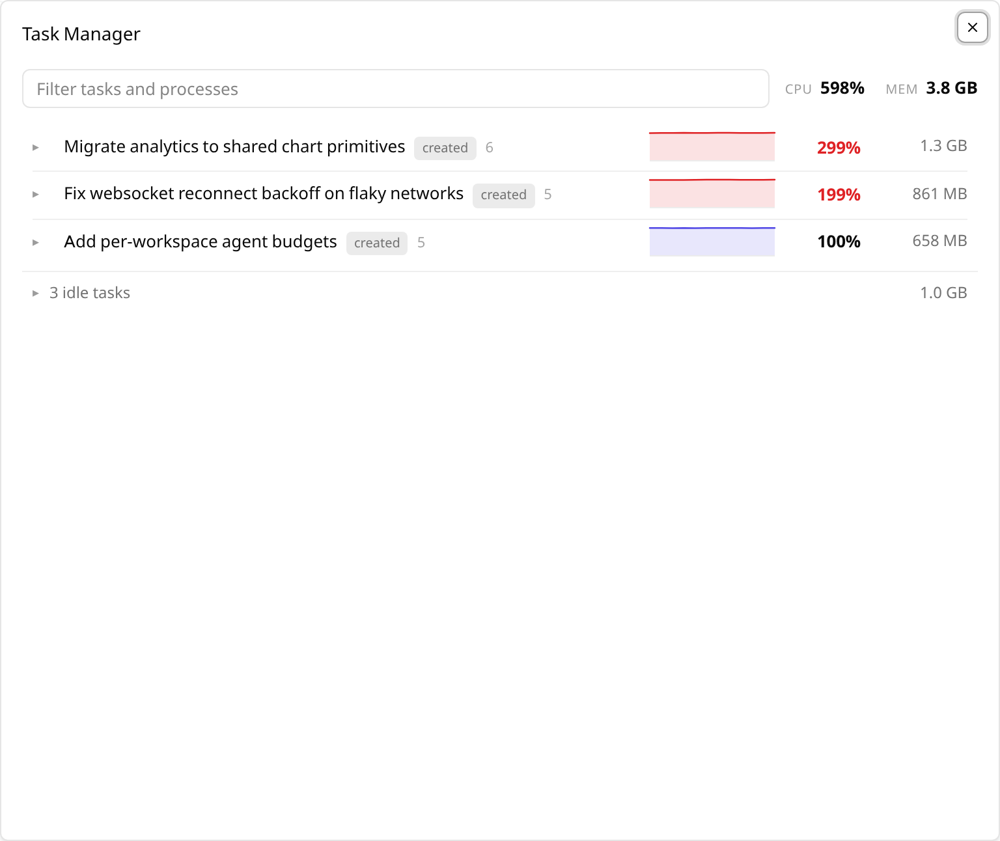
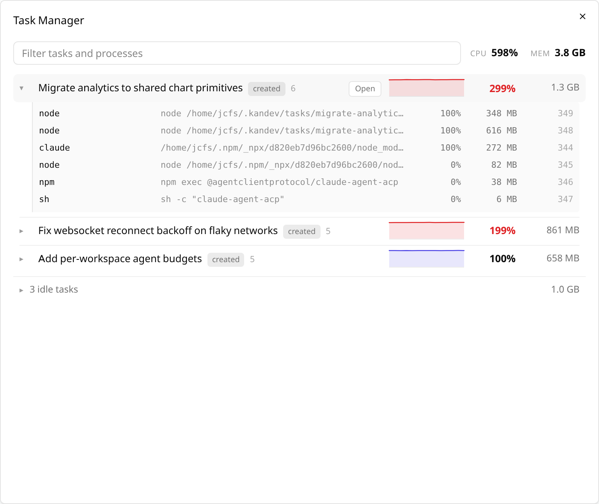
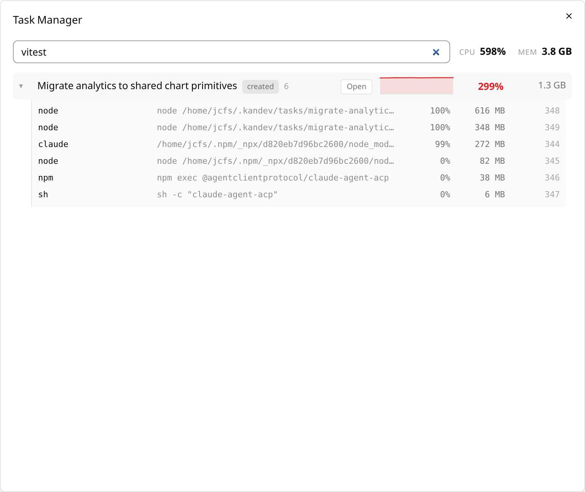
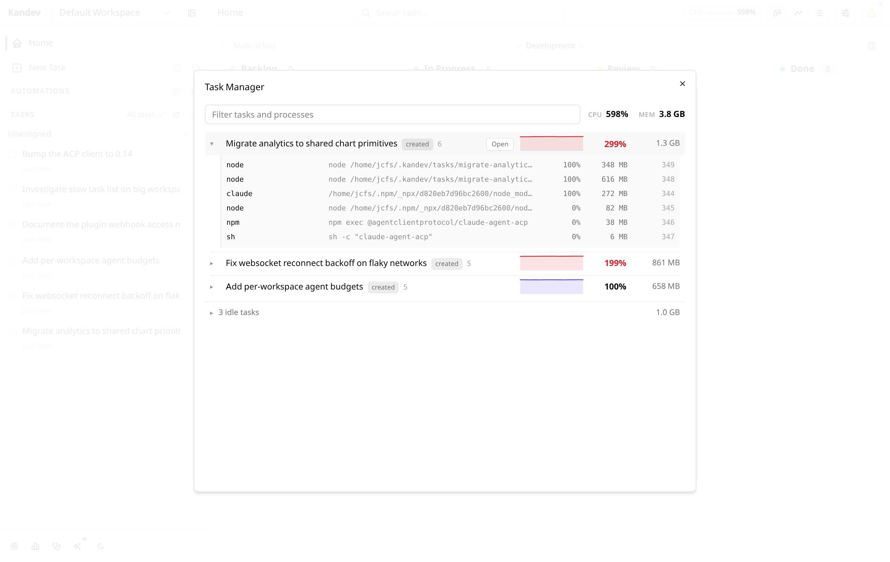

# Kandev Task Manager

Per-task CPU and memory for your running Kandev agents. Press
<kbd>Ctrl</kbd>+<kbd>Shift</kbd>+<kbd>Esc</kbd> (<kbd>⌘</kbd>+<kbd>Shift</kbd>+<kbd>Esc</kbd>
on macOS) and see which task is actually eating the machine.



## Why

A busy Kandev instance runs a dozen agents at once. When the fans spin up, the
host's own process list tells you that `node` is busy — not *which task* asked
for it. This measures the machine and attributes every process back to the
Kandev task that spawned it.

## What it shows

Expand a task to see the processes it owns: the agent, its tool calls, and
anything they started in turn.



- **CPU** as a live rate, where **100% is one core** — the `top`/`htop`
  convention. A task pegging one core reads 100%, not 6% of a 16-core box. The
  bar turns red past a full core.
- **A sparkline** of roughly the last 30 seconds, so you can tell a steady
  load from a spike.
- **Memory**, summed over the task's whole process tree.
- **Idle tasks folded away.** Most agents sit at zero waiting on a reply;
  listing twenty of them buries the one doing work. Anything under 1% CPU
  collapses into a single row you can expand.

Filter by task title, process name, command line or PID. Click **Open** to jump
to the task.



## How attribution works

Kandev exports `KANDEV_TASK_ID` and `KANDEV_SESSION_ID` into every agent's
environment, and every process the agent spawns inherits it. So attribution is
exact rather than guesswork:

1. A process that declares `KANDEV_TASK_ID` in its own environment belongs to
   that task.
2. Otherwise it inherits its parent's attribution — which is what covers a tool
   call that scrubbed its environment (`env -i make`).

Ancestry is used only as the fallback, because a process's own declaration is
the ground truth. That ordering matters: the other way round, a process that
deliberately re-declares the variable gets silently charged to whichever task
happened to spawn it.

This is also why a dev server that outlived its shell still shows up. Being
re-parented to `init` severs it from the tree, but it kept the inherited
environment, so it is still attributed correctly.

Note that `/proc/<pid>/environ` reflects the environment a process was given at
`exec` time. A process cannot unset its way out of attribution afterwards.

## Platform support

| Platform | Process table | CPU | Memory | Environment |
| --- | --- | --- | --- | --- |
| Linux | `/proc` | `utime`+`stime` delta | **PSS** via `smaps_rollup`, falling back to RSS | `/proc/<pid>/environ` |
| macOS | `ps` | `TIME` delta (centisecond resolution) | RSS | `sysctl KERN_PROCARGS2` |
| Windows | Toolhelp32 | `GetProcessTimes` | Working set | PEB via `ReadProcessMemory` |

Memory marked with `*` is RSS, which counts pages shared between a parent and
its children in *every* process, so a tree total reads high. Linux reports PSS
where it can, which splits shared pages proportionally and can be summed
honestly.

> **Windows is untested.** It compiles and its parsers are unit-tested, but the
> syscall path has never been run on a Windows machine. It fails soft: if the
> PEB read is refused, a process inherits its parent's attribution rather than
> crashing. Reports welcome.

## Install

Download the tarball from [Releases](../../releases), then either:

- **Settings → Plugins → Install** and upload it, or
- drop it in `~/.kandev/plugins/` and press **Sync**.

The hotkey is remappable in **Settings → Plugins → Task Manager**. A CPU chip
also appears in the top bar on the Kanban and Tasks views, and opens the same
panel.

The plugin requests `api_read: tasks` to show task titles. Its usage webhook
requires an authenticated host session. The manifest keeps plugin API v1 and
does not set `min_kandev_version`. A host with `host.ui.Action` shows a CPU
icon and percentage. An older compatible host keeps the current chip and its
meter.



## Cost

The top-bar chip polls every 4 seconds while its component is mounted. The
panel polls every 1.2 seconds while it is open.

A warm poll costs about **30 ms** on a machine running 24 tasks across 748
processes — essentially the cost of one `/proc` scan. Reading PSS for every
attributed process costs an order of magnitude more (~370 ms), so memory is
refreshed on its own slower cadence and reused in between. CPU percentages come
from a delta of cumulative CPU time across a 700 ms window, never from a
lifetime average like `ps %cpu`, which would report an agent that was busy an
hour ago as busy now.

## Development

Use Go 1.26 and Node.js 24. The UI is plain JavaScript. Node's built-in test
runner checks its host Action and legacy paths.

Clone the Kandev SDK beside this repository at the pinned source revision:

```sh
git clone https://github.com/kdlbs/kandev.git ../kandev
git -C ../kandev checkout "$(cat .kandev-sdk-ref)"
```

The Go SDK is not a separate module. `go.mod` reads it from
`../kandev/apps/backend`. The source pin is not a minimum host version.

Run the main checks and builds from this directory:

```sh
make check-format
make vet
make test
make build
make verify-package-host
make verify-package
```

`make test` runs Go tests, UI contract tests, negative package and release
checks, and the static-server and loopback tests for the browser harness.
`make verify-package-host` builds and checks one platform. The full package
command cross-compiles every platform in `manifest.yaml`, then checks the file
list and SHA-256 checksums.

The release workflow runs from `main`. It selects a version bump, checks the
candidate, and builds the full package before it commits a version or tag. A
pushed `v*` tag must match `manifest.yaml`, the Makefile, and the package.

The browser harness uses fake task and process data. Install its locked test
dependencies, then run its layout and ordering checks:

```sh
npm ci --prefix .harness
npx --prefix .harness playwright install chromium
make test-harness
```

For host review, build the package and upload it to an isolated local Kandev
host. Route the usage request to synthetic data, then run the desktop and mobile
checks. `HOST_ACTION=1` checks the Action path. `HOST_ACTION=0` checks the legacy
path. Use a host that includes the Action API for mode `1`, or a pre-Action API v1
host for mode `0`. Keep the host's home directory, database, and temporary files
inside a task-owned disposable directory.

```sh
make verify-package-host
KANDEV_URL=http://127.0.0.1:18080 \
  PACKAGE_FILE="$(make package-file)" \
  HOST_ACTION=1 make smoke-package
```

The rendered-host check covers accessible keyboard activation and the registered
shortcut, mobile touch size and fit, usage polling, and disable/re-enable
behavior. It validates only the selected package and host version; the layout
fixture alone does not certify host compatibility. This repository does not set
a minimum host version.

The live process diagnostic is optional. It samples the machine where it runs:

```sh
make live
```

## License

MIT — see [LICENSE](LICENSE).
